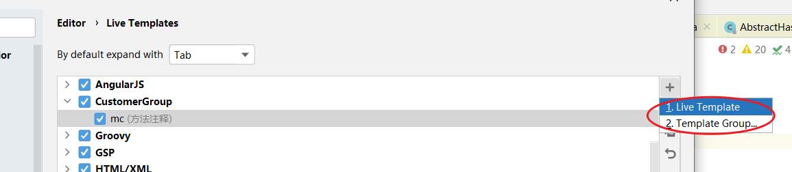
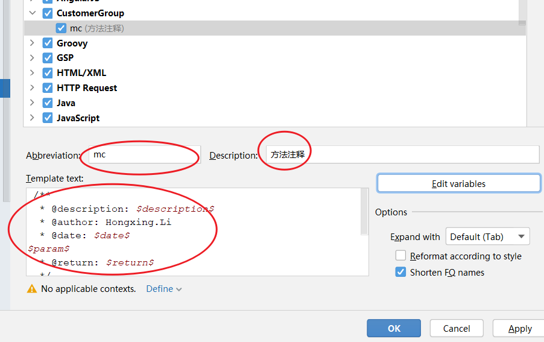
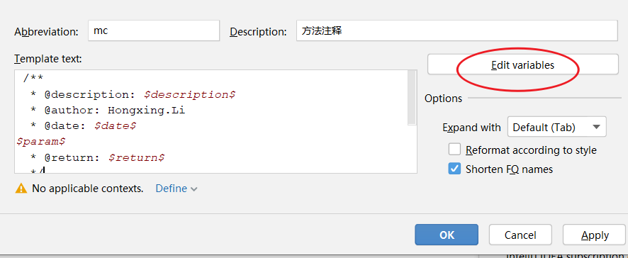
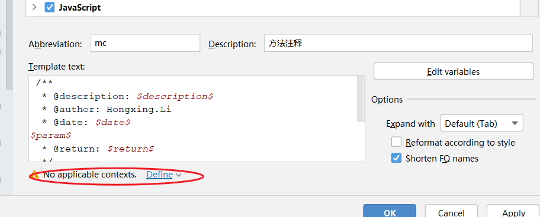

# <div style="text-align:center;color:#FF9900">IDEA配置</div>
*本文件记录一些IDEA比较生僻或复杂的配置*
##### 设置文件编码
* 位置：`Editor` →  `File Encoding`
* `Transparent native-to-ascii conversion`：[参考][关于Transparent native-to-ascii conversion]


##### 代码补全
* 位置：`Editor` →  `Live Templates`

##### 新建文件模板
* 位置：`Editor` →  `File and Code Templates`

##### 单行注释，非行首，空一格
* 位置：`Editor` →  `Code Style` →  `Java` → `Code Generaton`页签

##### 编辑窗口字体
* 位置：`Editor` →  `Font`

##### 启动时，非自动打开project
* 位置：`Appearance & Behavior` → `System Settings`

##### 编辑，自动提示，取消大小写敏感
* 位置：`Editor` → `General` → `Code Completion`

##### 方法注释
* 位置：`Editor` →  `Live Templates`
* 步骤：
  1. **创建分组**
     
  2. **添加模板**
     
  3. **填写相关输入框**
     ```Java
     *
      * $description$
      *
      * @author: Hongxing.Li
      * @date: $date$ $time$
     $parameterList$
      * @return: $var_return$
      */
     ```
     
  4. ***编辑变量**
     ```Java
     // 参数
     groovyScript("def result=''; def params=\"${_1}\".replaceAll('[\\\\[|\\\\]|\\\\s]', '').split(',').toList(); for(i = 0; i < params.size(); i++) {result+=' * @param: ' + params[i] + ((i < params.size() - 1) ? '\\n ' : ' ')}; return result;", methodParameters())
     // 返回类型
     groovyScript("return \"${_1}\".replaceAll('<', '&lt;').replaceAll('>', '&gt;').replaceAll(',', ', ')", methodReturnType())
     ```
     返回变量：`methodReturnType()`
     
     [idea“代码补全”模板中变量设置-官方文档]
  5. **选择适配内容**
    


[关于Transparent native-to-ascii conversion]:https://www.jianshu.com/p/11932ce51284
[idea“代码补全”模板中变量设置-官方文档]:https://www.jetbrains.com/help/idea/2019.2/edit-template-variables-dialog.html#predefined_functions
